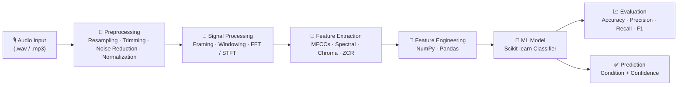

<div align="center">

# 🩺 SymptomsEase AI

### Audio-Based Health Screening with Machine Learning

A Python machine-learning pipeline that transforms raw audio recordings into health-condition predictions through **signal processing**, **acoustic feature extraction**, and **classical ML classification**.


</div>

---

## 📑 Table of Contents

- [Overview](#-overview)
- [Key Features](#-key-features)
- [System Architecture & ML Pipeline](#️-system-architecture--ml-pipeline)
- [Tech Stack](#-tech-stack)
- [Project Structure](#-project-structure)
- [Installation & Setup](#️-installation--setup)
- [Usage](#️-usage)
- [Dataset](#️-dataset)
- [Results](#-results)
- [Roadmap](#️-roadmap)
- [Contributing](#-contributing)
- [License](#-license)
- [Author](#-author)

---

## 🔍 Overview

**SymptomsEase AI** is my graduation (senior) project from the **University of Jeddah**. It explores how everyday audio recordings can support **fast, low-cost, and accessible preliminary health screening**.

The system takes a short audio sample, cleans and processes the signal, extracts meaningful acoustic features, and feeds them into trained machine-learning models that output a health-condition prediction with a confidence score. The goal is to demonstrate a complete, reproducible ML workflow — from raw `.wav` files all the way to an interpretable result — while bridging the gap between **digital signal processing** and **applied machine learning**.

> ⚠️ **Medical Disclaimer:** This project is an **academic proof of concept**, not a certified medical device. It is intended strictly for research and educational purposes and must **never** be used for real clinical diagnosis or to replace professional medical advice.

<!-- TODO: Add 1–2 sentences naming the exact condition(s) your model screens for
     (e.g., respiratory conditions, cough classification, voice biomarkers). -->

---

## ✨ Key Features

- 🎙️ **End-to-end audio pipeline** — from raw recordings to predictions in a single, reproducible flow.
- 🌊 **Robust signal preprocessing** — resampling, silence trimming, noise reduction, and normalization for consistent inputs.
- 🧠 **Rich acoustic feature extraction** — MFCCs, spectral features (centroid, roll-off, bandwidth), zero-crossing rate, and chroma.
- 📊 **Classical ML classification** — trained and benchmarked with Scikit-learn estimators.
- 📈 **Transparent evaluation** — accuracy, precision, recall, F1-score, and a confusion matrix for every model.
- 🧩 **Modular, extensible codebase** — preprocessing, feature engineering, training, and inference are cleanly separated.
- 🔁 **Reproducible experiments** — fixed random seeds and a pinned dependency list.

---

## 🏗️ System Architecture & ML Pipeline

The project follows a classic, stage-based machine-learning pipeline:



**Stage breakdown**

1. **Audio Input** — accepts standard audio formats and loads them as time-series signals.
2. **Preprocessing** — standardizes sample rate, removes silence and background noise, and normalizes amplitude so every sample is comparable.
3. **Signal Processing** — splits the signal into overlapping frames, applies windowing, and converts to the frequency domain (FFT/STFT).
4. **Feature Extraction** — derives a compact numerical fingerprint of each recording (MFCCs and spectral/temporal descriptors).
5. **Feature Engineering** — aggregates and structures features into a clean feature matrix using NumPy and Pandas.
6. **Model Training & Inference** — trains Scikit-learn classifiers, persists the best model, and serves predictions on new audio.
7. **Evaluation** — reports standard classification metrics and a confusion matrix to validate performance.

---

## 🧰 Tech Stack

| Category | Technologies |
| :--- | :--- |
| **Language** | Python 3.9+ |
| **Data Handling** | NumPy, Pandas |
| **Machine Learning** | Scikit-learn |
| **Audio & Signal Processing** | Librosa, SciPy |
| **Visualization** | Matplotlib, Seaborn |
| **Environment** | venv, pip |
| **Experimentation** | Jupyter Notebook |

> 🔧 *Trim or extend this list to match exactly what your repository uses.*

---

## 📁 Project Structure

```text
SymptomsEaseAi/
├── data/
│   ├── raw/                # Original audio recordings
│   └── processed/          # Cleaned / feature-extracted data
├── notebooks/              # Exploratory analysis & experiments
├── src/
│   ├── preprocessing.py    # Audio loading, cleaning, normalization
│   ├── features.py         # Feature extraction (MFCCs, spectral, etc.)
│   ├── train.py            # Model training & persistence
│   ├── evaluate.py         # Metrics & confusion matrix
│   └── predict.py          # Inference on new audio
├── models/                 # Saved/trained model artifacts
├── results/                # Plots, metrics, reports
├── requirements.txt        # Pinned dependencies
├── LICENSE
└── README.md
```

> 📌 *Adjust the tree to reflect your actual files and folders.*

---

## ⚙️ Installation & Setup

### Prerequisites

- Python **3.9+**
- `pip` and `git`

### Steps

```bash
# 1. Clone the repository
git clone https://github.com/FerasAlhkodari/SymptomsEaseAi.git
cd SymptomsEaseAi

# 2. Create and activate a virtual environment
python -m venv venv

# On macOS / Linux:
source venv/bin/activate
# On Windows (PowerShell):
venv\Scripts\Activate.ps1

# 3. Install dependencies
pip install -r requirements.txt
```

---

## ▶️ Usage

```bash
# Train the model
python src/train.py --data data/processed --out models/

# Evaluate a trained model
python src/evaluate.py --model models/best_model.pkl --data data/processed

# Run a prediction on a single audio file
python src/predict.py --model models/best_model.pkl --audio path/to/sample.wav
```

> 🛠️ *Replace the script names and arguments with your real CLI interface.*

---

## 🗂️ Dataset

<!-- TODO: Describe your dataset here. -->

- **Source:** *(e.g., public dataset name + link, or a brief note if private/academic)*
- **Size:** *(number of samples / total hours of audio)*
- **Classes:** *(the conditions/labels your model distinguishes)*
- **Format:** *(sample rate, file type, mono/stereo)*

*If the dataset cannot be shared publicly, state that here and describe its structure so others can reproduce the pipeline with their own data.*

---

## 📊 Results

| Model | Accuracy | Precision | Recall | F1-Score |
| :--- | :---: | :---: | :---: | :---: |
| *Model A* | — | — | — | — |
| *Model B* | — | — | — | — |

> 📈 *Fill in this table with your actual results, and consider adding a confusion-matrix image from the `results/` folder for extra impact.*

---

## 🛣️ Roadmap

- [ ] Expand the dataset and balance class distribution
- [ ] Benchmark additional models (ensemble methods, gradient boosting)
- [ ] Add a lightweight REST API for inference
- [ ] Build a simple web/mobile demo interface
- [ ] Containerize the application with Docker

---

## 🤝 Contributing

Contributions, issues, and feature requests are welcome.

1. Fork the project
2. Create your feature branch (`git checkout -b feature/amazing-feature`)
3. Commit your changes (`git commit -m "Add amazing feature"`)
4. Push to the branch (`git push origin feature/amazing-feature`)
5. Open a Pull Request

---

## 📄 License

Distributed under the **MIT License**. See the [`LICENSE`](LICENSE) file for details.

---

## 👤 Author

**Feras Alkhodari** — Backend Engineer · DevOps · Application Security

[](https://www.linkedin.com/in/feraswe/)
[](mailto:me@feraswe.com)
[](https://feraswe.com)

<div align="center">
<br>
<sub>Built as a graduation project at the University of Jeddah 🎓</sub>
</div>

---

# 🤖 AI Model Details

This repository contains the code and models for the SymptomsEase AI system, which can classify patient dialogs into different disease categories based on symptoms and conversation patterns.

## Project Overview

The SymptomsEase AI system is designed to analyze patient-doctor conversations and automatically classify them into one of seven disease categories. This can help healthcare providers quickly assess and triage patients based on their symptoms and complaints.

## Dataset

The model was trained on a dataset of patient-doctor dialogs, each labeled with a disease category (1-7). The original dataset had an imbalanced distribution of classes:

- Class 1: 1734 samples
- Class 2: 1400 samples
- Class 3: 547 samples
- Class 4: 519 samples
- Class 5: 221 samples
- Class 6: 249 samples
- Class 7: 152 samples

To address this imbalance, we performed undersampling to create a balanced dataset with 152 samples per class.

## Data Preprocessing

The text preprocessing pipeline included:

1. **Tokenization**: Using NLTK's RegexpTokenizer to extract words with 3 or more characters
2. **Lowercasing**: Converting all text to lowercase
3. **Stop Word Removal**: Eliminating common English words that don't contribute significant meaning
4. **Lemmatization**: Using WordNet lemmatizer to reduce words to their base form
5. **Bag of Words Representation**: Converting text to a numerical format using a sparse matrix representation

## Model Architecture

The model uses a neural network architecture with:

1. **Input Layer**: Matching the size of the feature vector (2730 features)
2. **Hidden Layers**: Multiple fully connected layers with ReLU activation
3. **Output Layer**: 7 neurons with softmax activation (for 7 disease categories)

The optimal model architecture was determined using Keras Tuner, which performed a random search to find the best combination of:
- Number of hidden layers (between 3-10 layers)
- Number of neurons per layer (between 4-128 neurons)

## Model Training

The training process included:

1. **Data Split**: Training (80%) and testing (20%) sets
2. **Feature Scaling**: Using MinMaxScaler to normalize the features
3. **Class Balancing**: Undersampling to create a balanced dataset
4. **Early Stopping**: To prevent overfitting, with a patience of 4 epochs
5. **Hyperparameter Tuning**: Using Keras Tuner to find the optimal model architecture

## Model Performance

The final model achieved impressive performance metrics on the test set:

```
              precision    recall  f1-score   support

           1       0.93      0.97      0.95      1734
           2       0.99      0.99      0.99      1400
           3       0.96      0.93      0.95       547
           4       0.94      0.87      0.90       519
           5       0.99      0.99      0.99       221
           6       0.88      0.92      0.90       249
           7       0.83      0.72      0.77       152

    accuracy                           0.95      4822
   macro avg       0.93      0.91      0.92      4822
weighted avg       0.95      0.95      0.95      4822
```

- Overall accuracy: 95%
- High precision and recall across all disease categories
- Slightly lower performance on category 7 (F1-score 0.77)

## Data Analysis Insights

1. **Data Imbalance**: The original dataset had significant class imbalance, with classes 1 and 2 being much more represented than others.
2. **Data Sparsity**: The feature matrix was very sparse, with only about 1.35% non-zero elements.
3. **Word Distribution**: Analysis of the most common words helped identify key terms related to each disease category.

## Repository Contents

- `Modified_EDA.ipynb`: Jupyter notebook containing the complete data analysis, preprocessing, and model development process
- `trained_model.h5`: The saved trained neural network model
- `scaler.pkl`: The fitted MinMaxScaler for feature normalization
- `features.pkl`: The list of features used in the model
- `visualization_plots.py`: Script for generating visualization plots
- `requirements_viz.txt`: Required Python packages for visualizations

## How to Use the Model

The model can be loaded and used to predict disease categories from new patient dialogs:

```python
import pickle
import numpy as np
from tensorflow.keras.models import load_model

# Load the trained model
model = load_model('trained_model.h5')

# Load the scaler and features
with open('scaler.pkl', 'rb') as f:
    scaler = pickle.load(f)
    
with open('features.pkl', 'rb') as f:
    features = pickle.load(f)

# Function to preprocess and predict
def predict_disease(patient_dialog):
    # Preprocess the dialog (tokenization, lemmatization, etc.)
    processed_tokens = dialog_to_processed_token_list(patient_dialog)
    
    # Convert to model input format
    input_vector = np.zeros(len(features))
    for token in processed_tokens:
        if token in features:
            input_vector[features.index(token)] = 1
    
    # Scale the features
    input_vector = scaler.transform([input_vector])[0]
    
    # Predict
    prediction = model.predict([input_vector])
    predicted_class = np.argmax(prediction) + 1
    
    return predicted_class
```

## Technical Implementation

1. **Libraries Used**:
   - TensorFlow/Keras for model building and training
   - NLTK for natural language processing
   - Scikit-learn for data splitting, scaling, and evaluation metrics
   - Pandas for data manipulation
   - Matplotlib and Seaborn for visualization

2. **Hardware Requirements**:
   - The model is lightweight and can run on standard hardware
   - Training can be accelerated with GPU but isn't necessary

3. **Model Selection**:
   - Neural networks were chosen for their ability to capture complex patterns in text data
   - Hyperparameter tuning helped optimize the model architecture

## Future Improvements

Potential enhancements for future versions:

1. **Advanced NLP Techniques**: Incorporating word embeddings (Word2Vec, GloVe) or transformer models (BERT)
2. **Data Augmentation**: Techniques to address class imbalance without losing data
3. **Multi-language Support**: Extending the model to work with languages other than English
4. **Explainability Features**: Adding tools to highlight which symptoms led to specific predictions
5. **Real-time Integration**: Developing APIs for integration with healthcare systems

## Conclusion

The SymptomsEase AI model demonstrates strong performance in classifying patient dialogs into disease categories. With an accuracy of 95%, it shows promising potential for assisting healthcare providers in quickly assessing patient conditions based on symptom descriptions.
